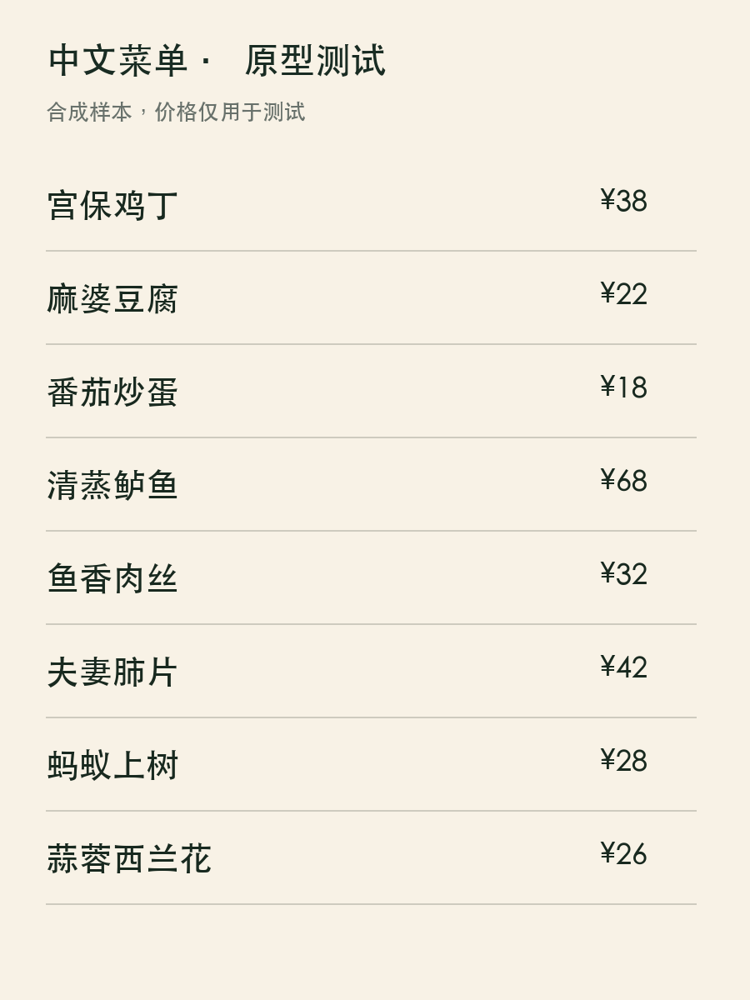
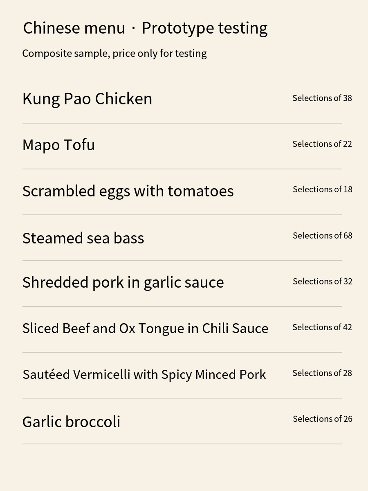
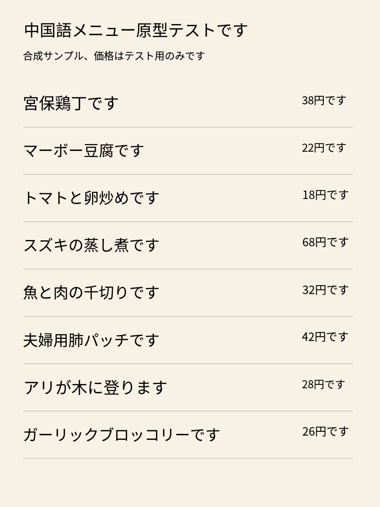
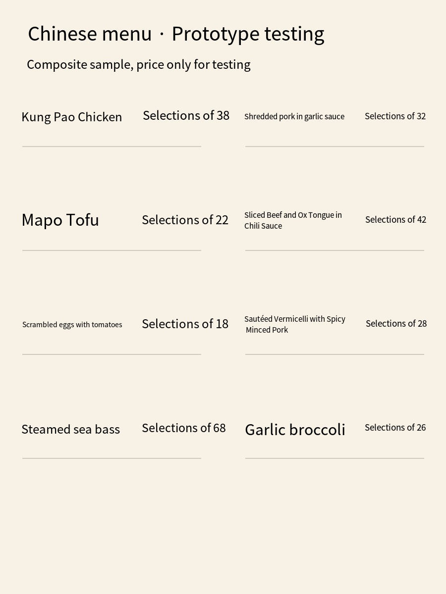
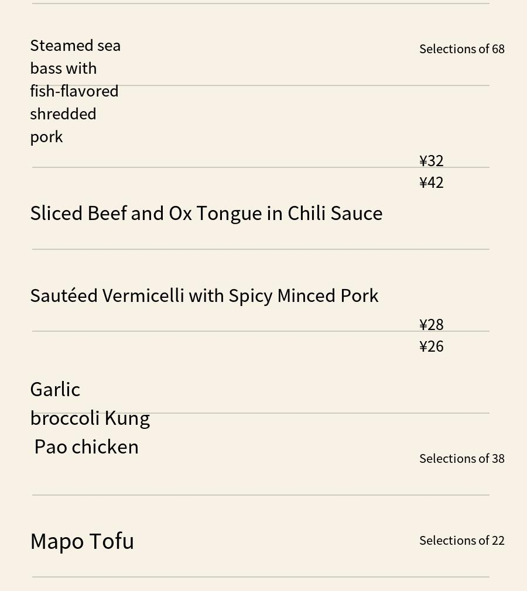
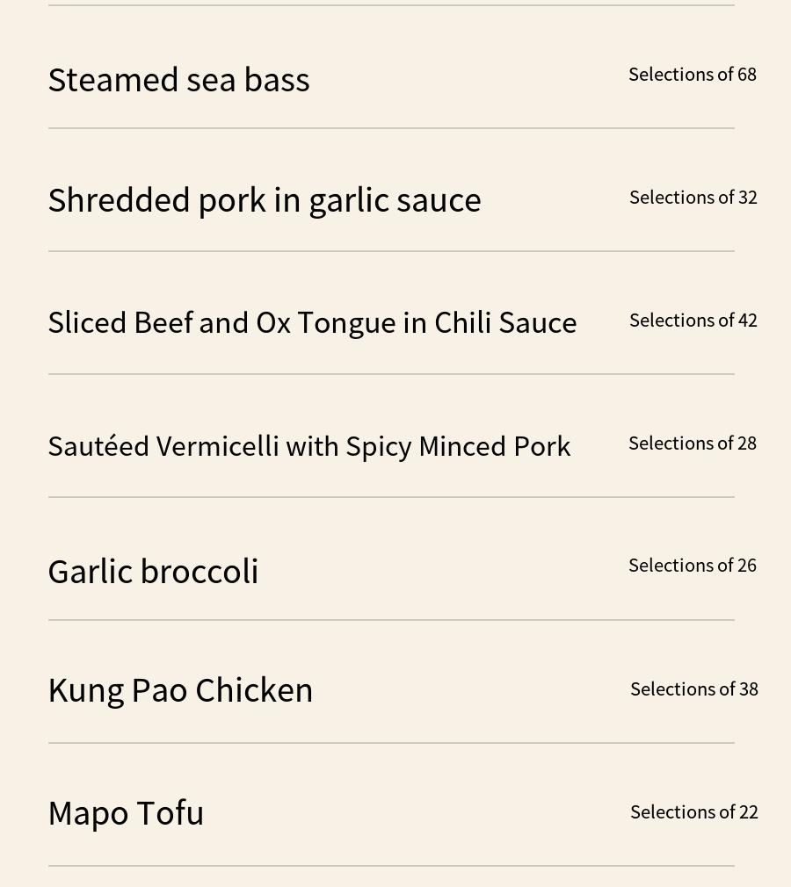
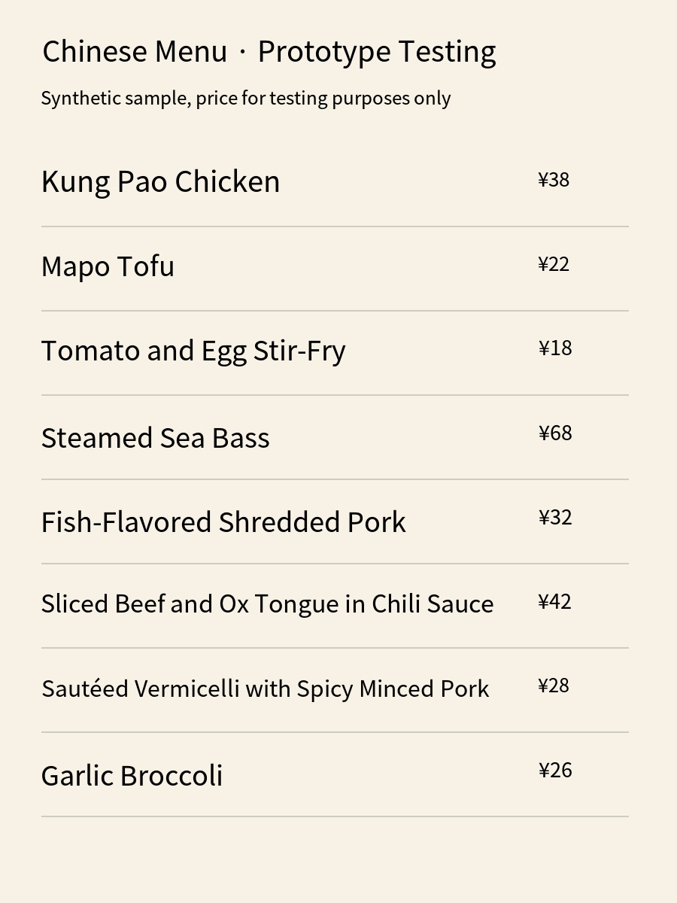

# 原图／译图对照

2026-10-06，本地生成菜单；价格与菜名仅用于测试。以下是供应商返回的实际图片，切片合成明确单列；没有人工改写供应商译文。完整四语结果见 [demo.html](../demo.html)。

## 单列英文：成图成功，价格误译

原图：

传统译图：

菜名与行的位置可读；`¥38` 变为 `Selections of 38`，8个价格均有该现象。该样本不能作为正式价格展示结果。

## 单列日语：币种语义错误

`¥38` 变为 `38円です`；“夫妻肺片”写为“夫婦用肺パッチです”，“蚂蚁上树”写为“アリが木に登ります”。这些输出不能因为已回填就视为正确菜单译文。

## 双列英文：小字号差异

基本列结构仍可辨认，但较长菜名被缩到比其他条目小得多；价格表达仍错误。图中没有真实餐厅纹理或食物照片。

## 长图：同一区域的整图／四片合成节选

整图输入900×4800，输出仍是原尺寸。下图截取输入y=575–1585区域，按原尺寸核对：

按已知行间空隙分成4片，分别调用相同传统英文模型，然后合成。相同位置的节选：

菜名合并与跨行排版在此节选中消失；价格误译仍在。切点为0、1275、2395、3515、4800，属于合成测试的已知行间位置，不能直接用于任意真实菜单。完整合成图见[long-stitched.jpg](2026-10-06-long-tiles/long-stitched.jpg)。

## 英文 Pro：价格改善，不能推广到全部语言

英文8个价格的 `¥` 保留。对应日语 Pro 仍输出 `38円` 等，因此不能用“换成 Pro”替代价格保护。Pro 仅有英语/日语各一次记录；没有进行所有语言、所有样本的重复比较。
