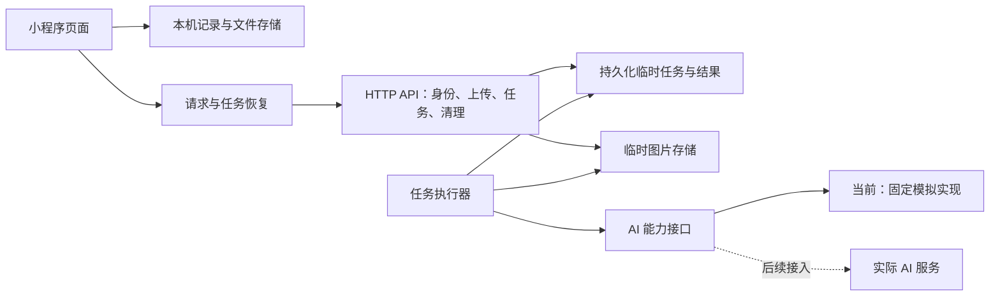

# 技术设计

- 更新日期：2026-10-06
- 状态：v0.1 本地开发基线。技术路线与身份方案已接受；实现、真实接入与发布验证仍需完成。

本文负责模块职责、本机数据、任务与材料的生命周期，以及接口之间必须满足的约束。具体功能行为与 D01–D20 验收见[功能规格](../product/functional-spec.md)，布局与状态画面见[页面设计](../design/README.md)，产品范围见 [PRD](../product/prd.md)。领域词义以 [GLOSSARY](../../GLOSSARY.md) 为准。

[OpenAPI](openapi.json) 是 HTTP 字段、类型、状态及错误结构的唯一维护位置；本文补充结构校验无法表达的跨对象、版本与时间约束。固定交换样例与场景见[模拟样例说明](mocks/README.md)。当前使用固定 AI 模拟实现，实际 AI 方案、回复策略和 Prompt 在后续阶段确定。

## 1. 模块与运行边界

前端沿用原生微信小程序 JavaScript／WXML／WXSS，后端采用独立 Node.js／TypeScript HTTP 服务。本地联调用 SQLite 保存临时任务与元数据，用项目外文件目录保存图片；取舍见 [ADR 0002](../adr/0002-native-miniprogram-node-service.md)。

| 模块 | 职责 |
| --- | --- |
| 小程序页面 | 收集操作，展示业务状态；通过业务对象读取结果，供应商原始返回由后端适配 |
| 本机仓库 | 保存记录、图片文件、消息、偏好、个人沟通卡、草稿、浏览状态、保存状态、恢复关联和删除标记 |
| 请求与恢复层 | 上传、提交、查询、重试、应用结果与发送保存回执；页面重建时复用已保存的业务 ID 和请求关联 |
| HTTP 服务 | 验证身份和资源归属，管理上传、不可变快照、任务与清理；持久化成功后才确认接收 |
| 任务执行器 | 读取冻结输入，执行任务并持久保存结果；与小程序页面、连接及单次 HTTP 请求的生命周期分离 |
| AI 适配层 | 将模拟或实际服务的输出转换成同一业务契约；供应商合并返回多类结果时，拆为相应业务阶段 |

完整历史、偏好和个人沟通卡以本机保存为准，后端只保留处理与恢复所需的临时输入、任务和结果，见 [ADR 0001](../adr/0001-local-history-temporary-processing.md)。云平台尚未选择；部署时需落实数据库、图片存储与执行器运行方式，持久化材料必须能跨请求与进程重启保留。

## 2. 本机数据与关联

本机模型包含 HTTP 交换之外的保存、浏览和恢复信息。标识符使用不透明字符串，时间使用带时区的 ISO 8601；未知值使用 `null`。价格保留识别原文，可确认金额按 OpenAPI 的 `Price` 结构保存为十进制字符串，不能用 `0` 或空文本代替未知金额、单位或规格。

| 对象 | 本机保存内容 | 关联约束 |
| --- | --- | --- |
| Record | `id, createdAt, updatedAt, imageIds, cardIds, messageIds, contextId?, saveState` | `id` 是历史主键；`contextId` 指向可过期、可重建的临时上下文，选图等状态由记录浏览状态维护 |
| ImageInput | `id, recordId, kind, order, localOriginalPath, uploadState, assetId?, targetLanguage, stageJobs` | 一图属于一条记录；`kind=menu/dish`；保存来源、顺序、原图、上传状态与各阶段任务关联 |
| 本机图片条目 | `id, imageId, kind, contentLanguage, assetId?, remoteUrl?, localPath?, saveState`，以及服务端返回的资源描述 | 原图和译图分别保存文件与保存状态；HTTP 的 `ImageArtifact` 只描述译图，`localPath`、`saveState` 由客户端维护 |
| DishCard | OpenAPI 的 `DishCard` 完整内容 | 保留 `recordId` 与 `sourceImageIds`；同一卡片可关联多图；当前图片筛选只影响展示，整条记录的卡片与聊天范围保持完整 |
| DietaryAssessment | `cardId, preferencesVersion, state, warnings, concern?, checkedAt?` | 与菜品解释正文分开保存，检查结果绑定偏好版本 |
| Message | `id, recordId, role, text, contentLanguage, state, saveState, inReplyTo?, jobId?, attempt, contextSnapshotVersion?, preferencesVersion?, attachments` | 用户问题和对应回复各有稳定 ID；重试更新同一回复，恢复层保存当前任务、尝试号及已应用版本 |
| PersonalCard | OpenAPI 的 `CardContent` 完整内容，加 `id, order, color, edited, presetId?, sourceMessageId?, saveState` | `order` 是本机卡库的全局顺序；收藏时复制完整文字与语言并生成个人卡片 ID；来源标识仅供追溯，展示与保存不依赖来源记录 |
| Preferences | `version`、三类已选项及各类补充原文；据此构建符合 OpenAPI 的 `Preferences` 快照 | 统一保存后增加版本；表单编辑与已生效偏好分开，请求仅携带已保存快照 |
| 聊天草稿 | `recordId, text, inputVersion, updatedAt, saveState` | 每条记录独立保存，暂离与退出后恢复；不作为已发送消息进入聊天快照 |
| 记录浏览状态 | `recordId`、当前图片、按 `imageId` 保存的原译选择、结果与聊天阅读位置、聊天是否处于底部 | 原译选择属于图片；阅读位置属于记录及视图，新输出只更新内容和状态，不覆盖用户的浏览选择 |
| 沟通卡草稿 | 标题、分类、颜色、双方文字、源语言与目标语言、所编辑卡片的关联，以及 `localScopeId, inputVersion, requestId?, jobId?, saveState` | 草稿自动本机保存，可跨退出恢复；主动保存才创建或更新正式卡片，放弃后旧响应不能恢复草稿 |
| 当前文字交流 | “我说／店员说”双方各自的最近原文、对应译文、未发送草稿与请求状态，以及各自的 `localScopeId, inputVersion, requestId?, jobId?` | 一份本机当前交流，可跨退出恢复，不建立历史列表；切换说话者不混用草稿与结果，主动清空后迟到结果不得恢复旧交流 |
| 卡库浏览状态 | 当前分类、收展状态与浏览位置 | 本机保存并跨退出恢复；用户切换分类时保留收展状态，从所选分类第一张开始；不改变卡片全局顺序 |
| LocalDeletion | `scopeType, localScopeId, contextIds, pendingCleanupIds, deletedAt` | 仅保留防止迟到写回和后端清理所需的标记，不保留已删除图片或聊天正文 |

本机保存完整业务结果；只有新任务需要的部分进入临时快照。服务端另行持久保存上下文版本、Job 及其内部 `owner`、冻结输入和幂等关系；`owner` 不从请求正文接受，也不在 Job 响应暴露。

卡库使用同一份 `PersonalCard.order`，业务规则见[功能规格 7.1](../product/functional-spec.md#71-卡库与排序)。分类内重排只将可见卡片写回原有全局位置，一次排序的全部更新整体保存；失败可重试，重启读取最后成功保存的完整顺序。排序只更新本机顺序，不修改文字、语言或来源，也不进入 `CardContent` HTTP 契约。

### 2.1 状态与语言

以下为客户端状态；服务端 Job、输出和清理状态以 OpenAPI 为准。

| 状态维度 | 值与用途 |
| --- | --- |
| 上传 | `pending / uploading / uploaded / failed` |
| 图片输出 | `pending / ready / not_required / failed`；`not_required` 表示无须译图，不是失败 |
| 本机保存 | `pending / saving / saved / failed`；文字、原图、译图分别跟踪 |
| 消息 | `draft / sending / queued / receiving / complete / failed` |
| 偏好检查 | `pending / checking / current / failed` |

记录的处理中、部分成功等汇总状态由各图片、阶段和保存状态推导，不能用单一布尔值替代。任务成功只说明处理完成；本机文件写入成功才构成离线副本，远程下载地址不构成离线保存。

界面语言单独保存为设置，由内置五语言资源驱动静态文案。图片输入的 `targetLanguage` 与输出的实际 `contentLanguage` 分别记录；已有动态内容的语言从自身数据读取。切换界面语言只更新静态资源，不改写动态内容或触发上下文重建。当前请求显式携带模拟场景目标语言，实际 AI 回复语言规则留待后续设计。

### 2.2 浏览状态与返回路径

以下状态由客户端维护，不扩展 HTTP 契约；行为见[功能规格](../product/functional-spec.md)，页面关系见[核心页面规划](../design/pages.md#navigation)。

- 原图／译图选择按稳定 `imageId` 关联。没有已有选择时，首次展示依据当时译图是否可用解析默认值；展示后由用户操作改变，后台译图就绪不能重新执行默认选择并替换当前画面。结果和全屏读写同一份选图状态。
- 图像任务创建时在本机保留其 `jobSnapshots[kind]` 冻结快照，用于校验返回卡片的来源。一个卡片的所有来源必须属于同一记录的该次快照内已上传图片，且包含当前处理目标；不能使用后来追加的图片扩充旧任务的来源。筛选与未保存结果的临时展示不改写整条记录或后续聊天快照。
- 结果与聊天分别保存阅读位置；有动态内容的列表优先用可见条目 ID 与相对位置恢复，避免仅靠绝对滚动量造成内容插入后错位。聊天同时记录是否贴近底部；不在底部时更新“有新回复”状态，保留原阅读位置。
- 页面进入时记录来源视图、业务 ID 与浏览状态键，返回恢复该来源，避免所有结果页统一返回拍照首页。首页最近记录、历史、预览和设置各自保持对应的返回路径。
- 恢复先校验记录、图片和阅读锚点仍存在；删除关联内容时清理其草稿与浏览状态。失效位置采用页面稿中约定的可见回退，不恢复已删除内容或重复提交任务。

## 3. 上下文与提交

### 3.1 不可变快照

临时上下文有两种用途，结构见 OpenAPI 的 `ContextRequest`：

| `purpose` | 本机作用域 | 允许的任务 |
| --- | --- | --- |
| `record` | `localScopeId=recordId`；按需提交图片、卡片、已完成消息与偏好快照 | `image_cards`、`image_translation`、`chat`、`dietary_review` |
| `communication` | `localScopeId` 对应独立卡片草稿或文字交流请求；仅提交必要文字和语言，不带 `recordId` | `text_translation` |

上下文的所有者、用途与本机作用域在创建后不可更改。快照按 `snapshotVersion` 保存：同版本同内容可幂等重发，同版本不同内容返回冲突，旧版本不能覆盖新版本。

每个任务必填 `input.contextSnapshotVersion`。后端接受任务时，在同一持久化事务中解析该版本、检查依赖、固定必要输入并保存任务；执行器读取冻结版本。之后追加图片、修改偏好或上传新快照，只影响新操作。被任务引用的快照和图片依赖按[保留规则](#retention)管理。

### 3.2 图片上传与阶段提交

本轮本地实现的输入边界为每批最多 9 张、每张不超过 20 MiB，支持 JPEG、PNG 和 WebP。它们用于统一预览校验和复现超限场景；正式限额仍需结合真机文件、内存与上传验证确定。界面只说明当前可接收的数量、大小与格式，联调阶段的限定保留在开发文档中。

预览阶段只保留草稿材料。用户确认提交后，请求层按以下顺序执行；首次完整交换见模拟场景 S06。

1. 本机保存记录、图片顺序和本次操作的稳定请求标识。新建入口生成新的 `recordId`，追加入口使用已有 ID。本机写入失败时保留失败状态并反馈，不能确认已建立可恢复记录。
2. 创建版本 1 的记录快照，待上传图片的 `assetId=null`。追加图片时使用该上下文的新版本，并保留已有内容。
3. 领取上传凭证，按 `uploadMethod`、`uploadHeaders` 向动态 `uploadUrl` 发送字节。上传地址不附加业务 Bearer 令牌。
4. 调用上传完成接口。后端验证实际文件后返回 `assetId`；重复完成返回同一结果，不启动任务。
5. 将资产关联写入新的快照版本。多图可并行上传，请求层串行分配后续快照版本，保留其他已完成的关联。
6. 对所需图片阶段创建任务，引用已绑定所需资产的版本。上传完成接口本身不修改历史快照，也不隐式启动 AI。

客户端以 `record.captureBatches[batchId].imageIds` 保存每次确认的图片成员与顺序，新建和追加共用批次处理入口。每张图片上传成功后立即提交其卡片和译图阶段，不等待其他图片。文件字节传输可并行；创建、重放及绑定完整快照通过同一记录的短队列串行执行。队列每次先重放已保存的待确认快照，再从最新记录构造下一版本；同批其他图片的资产、卡片及已有完整对话不会因较晚响应而丢失。

接受图片任务前，后端检查目标图片属于对应记录且包含在冻结快照中，`assetId` 与模式符合已确认上传。卡片和译图分别跟踪：适配层可以拆分供应商合并输出，但只报告可确认的阶段，不伪造进度百分比。成功结果中的卡片 ID、图片来源及资源归属必须与输入对应。

未上传成功的材料保留为本机待上传项，由用户明确恢复提交。网络恢复可继续查询已接收任务、下载已生成结果和清理已删除上下文。上传凭证过期后可重新领取；单独刷新凭证不启动 AI。

### 3.3 独立文字操作与草稿版本

个人沟通卡创建／编辑的翻译、沟通卡页的双向文字翻译均使用 `communication` 上下文，不因翻译操作创建菜单历史。

创建和编辑卡片通过 `cardDrafts` 管理输入与独立翻译，通过 `cardRepository` 提交本机变更。`personal-cards` 本机值内的 `drafts` 与正式 `cards` 分离；新建草稿使用 `new` 槽位，编辑草稿使用 `edit:<cardId>` 槽位，互不覆盖。主动保存用一次本机写入创建或更新正式卡片，并移除对应草稿，避免正式内容已保存、草稿却未清理的中间状态。编辑提交保留卡片 ID、全局顺序和来源信息；写回前校验目标卡仍存在、作用域与输入版本仍有效。删除卡片同时移除其编辑草稿，旧页面实例不能重新写入已放弃或目标已删除的草稿。

沟通卡草稿独立于正式卡片持久保存。编辑期间不能提前覆盖可展示的正式卡片；主动保存成功后才提交新内容并清理对应草稿，失败时保留草稿与明确的保存状态。双向文字交流分别保存双方最近结果与未发送草稿；切换说话者切换相应输入，不能使一方的结果覆盖另一方。浏览状态、草稿与当前交流都由本机仓库恢复，不依赖后端临时上下文持续存在。

草稿每次修改增加 `inputVersion`；每次明确提交新翻译生成新 `requestId`，网络重发复用该请求。任务输入的文字、语言、`inputVersion` 必须与所引用快照一致。修改草稿只更新本机输入，不自动提交翻译。

应用翻译结果前，请求层检查本机草稿或交流请求仍存在，并同时匹配当前 `inputVersion`、`requestId` 和 `jobId`。旧翻译不能覆盖新文字，已丢弃草稿的结果不能新建卡片或菜单记录。

放弃草稿或清空当前交流时，先使原本机作用域及其未完成请求失效，再重置对应内容；后续输入使用新的有效作用域，防止清空前的迟到翻译重新填入页面。清空只作用于当前交流，不删除正式沟通卡或其他菜单记录。

## 4. 任务执行与结果应用

### 4.1 稳定业务目标

请求级幂等之外，服务端以“上下文 + 任务种类 + 稳定业务目标”防止重复创建工作。相同正文返回原任务，不同正文返回冲突；正文中的集合使用一致的归一化比较规则。

| 任务种类 | 稳定业务目标 | 跨对象约束 |
| --- | --- | --- |
| `image_cards` | `imageId` | 目标图片、资产、输入模式符合冻结记录快照；输出保留稳定卡片 ID 与图片来源 |
| `image_translation` | `imageId` | 目标图片和资产符合冻结记录快照；输出语言来自实际结果，译图资源与无须译图区别处理 |
| `chat` | `userMessageId + assistantMessageId` | 消息 ID 对绑定同一记录；输出中的菜品引用必须属于该记录 |
| `dietary_review` | `cardIds` 集合 + `preferencesVersion` | 卡片集合、卡片内容、偏好版本与冻结快照和任务输入一致 |
| `text_translation` | `requestId` | 文字、语言与 `inputVersion` 符合冻结沟通快照 |

各类输入和输出按各自 OpenAPI 结构校验。服务端同时检查[用途限制](#snapshots)和[所有者](#identity)，不能用结构合法代替资源归属与依赖一致性校验。

### 4.2 重试、尝试号与版本

重试接口只接受 `state=failed` 且 `retryable=true` 的任务，`expectedAttempt` 必须匹配当前尝试。重试保留原冻结输入，增加 `attempt`；同一次重试的网络重发沿用原幂等键，不增加执行次数。图片重试只针对失败的图片或阶段，保留其他已成功输出。

`revision` 在同一 Job 的所有尝试中单调递增，不随重试重置。执行器写回时校验尝试号仍为当前值；旧尝试不能提交新版本。客户端应用结果时也检查当前关联的 `jobId`、`attempt` 和 `revision`，拒绝旧任务、旧尝试与迟到版本。上下文过期后，用户显式重试若建立新 Job，旧 Job 不得覆盖新的关联。

超时等未知网络结果先查询原任务或按[幂等规则](#idempotency)重发；轮询、页面重建和重新进入不自动执行失败任务。更换问题或使用新偏好属于新操作，不能借重试改写旧任务输入。供应商是否需要重复底层计算由后续适配方案确定，已成功的业务结果继续保留。

### 4.3 聊天顺序与部分回复

发送前生成并保存用户消息 ID 和对应回复 ID。聊天引用的历史快照排除本次提问及待生成回复；本次提问只由任务输入提供，后端按稳定 ID 防止重复组装。

本轮每条记录同时接受一条用户聊天请求。回复期间可编辑本机草稿，草稿按 `recordId` 自动保存并跨退出恢复，不自动发送。发送时先将草稿内容写为稳定的本机用户消息；清理草稿时核对其输入版本，避免清除发送期间新编辑的文字。本机用户消息、对应回复 ID 与匹配输入版本的草稿清理由同一次记录写入提交；写入失败时保留原草稿，网络接收失败也不把已保存的问题恢复成未发送草稿。主动清空只清理当前记录的草稿，不影响已发送消息。后端接收后，页面离开或连接断开不停止任务。部分回复使用 `complete=false`，失败时保留片段并标记未完成。

重试继续关联原问题和原回复 ID。等待时可保留旧片段并显示当前状态；新尝试成功后替换旧片段，不能拼接两次尝试。若将来放宽发送并发，需要先明确消息排序与上下文组装规则。

对话只引用当前记录菜品；本轮不维护独立购物车或已选菜品状态。算价与其他 AI 回复均使用固定模拟内容，真实计算和追问策略留待 AI 设计。

### 4.4 偏好检查

偏好的三类补充在本机分别维护。构建 `Preferences` 请求快照时，将补充原文按类别标记汇入现有 `notes` 字段；本机表单仍从分组字段恢复，不从传输文字反解析。此映射不调用 AI，也不改变补充文字的含义。

表单统一保存成功后增加本机 `Preferences.version`，相关 `DietaryAssessment` 转为待检查；尚未保存的选项和三类补充保持在编辑状态。新检查任务冻结当前偏好和相关卡片；后端校验目标 `cardIds`、`preferencesVersion` 与输入快照一致，输出逐项绑定卡片与偏好版本。

`DietaryAssessment.concern` 提供 `conflict / possible_conflict / unknown` 三种结构化类别，供页面及推荐筛选复用；旧结果缺少类别时按 `unknown` 处理。`current` 只表示对应偏好版本的检查完成，不表示安全保证，也不从 `warnings` 文字反解析类别。

客户端只有在返回版本仍匹配当前偏好时，才将检查更新为 `current`。旧检查不能覆盖新版本；检查失败保留可辨认状态。检查记录与冻结请求保存在本机 `dietaryReviews`，提示独立保存在 `dietaryAssessments`；成功保存偏好后，对已有菜品发起新检查。未送达的检查保留待检查状态，重进只查询，用户明确继续才重发原请求键；失败任务的重试沿用冻结输入。提示保存失败时保留可读结果，并单独提供本机重存，不再生成。旧对话保留原文，通过消息的 `preferencesVersion` 判断推荐是否需要重新确认，后续新操作使用新快照。

## 5. 保存、恢复与删除

### 5.1 本机保存与回执

结果应用到页面后，本机仓库分别持久保存文字／结构和图片文件，记录各自保存状态；空间不足或写入失败必须反馈。原图和译图独立保存，缺少本机文件的条目不能被当作已保存图片。

保存回执区分三个事实：

| 回执字段 | 确认内容 |
| --- | --- |
| `appliedRevision` | 该版本已应用到界面 |
| `locallySavedRevision` | 该版本文字／结构已持久保存；未保存成功时为 `null` |
| `locallySavedArtifactIds` | 对应资源的本机图片文件已写入成功 |

后端校验回执版本不大于已交付版本，`locallySavedRevision` 不大于 `appliedRevision`，图片 ID 属于该任务已交付资源。回执按版本合并，先前确认的保存状态不因后续回执回退。显示过的结果、失败的保存或旧版本回执，都不能授权清理尚未保存的新结果。

### 5.2 重新进入与上下文重建

打开历史先读本机记录和文件，按 `Record.createdAt` 倒序展示，再用保存的上下文及任务关联恢复未完成工作。进入记录时恢复[浏览状态](#view-state)及该记录草稿；后台任务更新不覆盖用户阅读位置或草稿。按上下文分页查询任务时，持续读取至 `nextCursor=null`；同一任务按稳定 ID 合并，不新增记录或重复提交。

后端上下文过期不影响本机内容回看。用户主动发起新的聊天或图片处理时，若原上下文已经过期，则生成新 `contextId`，按新操作需要上传本机文字快照与图片。保留本机 `recordId` 和原消息 ID；重建只准备新输入，不重译或重生成已有历史。

若必要本机材料缺失，提示补图或补充输入，不能编造缺失菜单。界面语言切换不属于新操作。后端 Job 与冻结输入须在进程重启后可恢复，具体实测列入[验证](#validation)。

### 5.3 临时材料保留与下载地址

后端返回 `expiresAt`，按配置管理输入、任务与结果的保留期限。已交付结果可在收到实际保存回执后按策略提前清理，但同时需要检查文件是否保存、是否存在较新结果，以及其他活动任务是否仍依赖该快照或图片。保留窗口内的活动依赖不能被提前清理。

到达任务硬性过期时间后，停止接受新写回并返回过期状态。具体数值在资源和真实接入验证后确定，先用可控时钟验证到期行为；样例时间不构成保留时长承诺。

图片下载地址是短期凭证。临时结果仍在保留期内时，重新查询 Job 可获取新地址；刷新地址不改变内容 `revision`，不重跑模型，也不重置本机保存状态。本机历史不按服务端期限自动过期。

### 5.4 删除与迟到结果

客户端先持久写入删除标记，再移除记录及关联内容，并保存最小后端清理队列。上传完成、任务结果、偏好检查和其他异步响应写入本机前，都检查目标仍存在且未删除；记录任务检查记录，独立翻译检查对应草稿或交流请求。个人收藏卡片已有独立内容，删除来源记录不级联删除收藏。

后端接收删除后，先阻止该上下文的上传完成、任务创建／重试和结果写回，再异步清理材料。可取消任务予以取消；无法取消的外部调用返回后丢弃结果。离线清理队列在联网后继续执行；本机删除完成与服务端清理状态分别记录。第三方留存与删除边界按 PRD R6 核实，不能据本机或服务端状态宣称第三方已完成删除。

删除标记至少覆盖未完成任务、上传与允许重试的窗口。仍持有本人删除标记时，重复删除返回同一清理任务；旧 ID 不能被迟到的 PUT 重建。不存在且无本人标记的资源返回 404，新上下文使用新 ID。

本地实现由 `records` 在一次写入中持久保存 `record-deletions` 日志与最小清理关联，读取和更新记录时统一检查该日志。随后移除 `records` 中的内容、记录图片目录及对应阅读位置；文件移除失败仍保持隐藏，并在删除状态中提供重试。日志仅保留记录、批次和上下文标识、时间与清理状态，不保存图片或对话正文。未提交过临时材料的记录不请求服务端清理。已在途的上下文 PUT 若在删除后才确认，立即再次执行该上下文的清理。

`deletions` 在网络恢复、应用重新进入或手动重试时继续清理，逐个保存 `cleanupId` 并查询结果。服务端通过 `cleanups` 表保存清理状态，先在事务中设置 `contexts.deleted`，再移除上传文件、译图、任务、快照及包含内容的幂等响应。当前本地联调永久保留无正文的删除标记，覆盖全部允许写回的窗口；正式部署的标记清理策略仍按发布检查确定。

## 6. 身份与 HTTP 使用

### 6.1 身份与资源所有者

正式环境通过后端验证微信登录凭证并换取短期业务访问令牌，取舍见 [ADR 0003](../adr/0003-wechat-session-business-token.md)。`openid` 与资源归属由后端验证；AppSecret 和微信 `session_key` 保留在后端。客户端提交的 `recordId` 或其他用户标识不能替代凭证。

每次访问上下文、上传、图片、任务或清理记录均校验令牌所有者，任务引用的资源也必须归该所有者。本地模拟身份仅在开发配置中启用，测试身份来自开发配置；正式环境不注册 `/v1/dev/session`，返回 404。该方案已接受，真实登录配置、令牌时效和过期处理仍需验证。

### 6.2 请求幂等

领取上传凭证、完成上传、创建任务和重试请求携带 `Idempotency-Key`。同一所有者、HTTP 方法、路径和键绑定原请求正文及同一业务结果；同键不同正文返回冲突。网络重发保持 `jobId` 与冻结输入不变，任务状态仍可正常推进。

后端在返回接受成功前持久化任务和幂等关系。幂等有效期覆盖允许重试的窗口，并与删除标记期限一起确定。上下文 PUT 使用[快照版本规则](#snapshots)，任务创建另有[稳定业务目标约束](#jobs)；仅更换请求键不能重复创建相同工作。

### 6.3 接口调用与错误

接口采用普通 JSON、异步任务与状态查询；当前用轮询验证恢复，是否为真实模型增加流式传输留待实测。下表用于定位接口，精确字段、状态码和错误枚举查阅 [OpenAPI](openapi.json)。

| 调用目的 | 端点 |
| --- | --- |
| 获取正式／本地开发身份 | `POST /v1/session`、`POST /v1/dev/session` |
| 建立快照版本 | `PUT /v1/contexts/{contextId}` |
| 领取凭证与确认文件 | `POST /v1/uploads`、`POST /v1/uploads/{uploadId}/complete`；字节上传使用返回的动态地址 |
| 接收任务与恢复进度 | `POST /v1/jobs`、`GET /v1/jobs/{jobId}`、`GET /v1/contexts/{contextId}/jobs` |
| 显式重试与确认保存 | `POST /v1/jobs/{jobId}/retry`、`POST /v1/jobs/{jobId}/ack` |
| 删除临时上下文与查询清理 | `DELETE /v1/contexts/{contextId}`、`GET /v1/cleanups/{cleanupId}` |

记录、偏好和个人卡片 CRUD 由本机仓库承担；后端接口只承接本轮所需的身份、临时材料与处理任务，不另建长期历史、菜名修改或点餐清单接口。

错误按 OpenAPI 的 `Error` 返回。前端使用 `messageKey` 对应的静态语言资源展示错误，保留原输入与已成功内容；依据错误类型区分身份、输入、上传、依赖、状态或版本冲突、过期、限流与临时失败。`retryable` 不能代替[任务重试条件](#retry)，网络结果未知时按原工作恢复。

业务令牌仅发往业务 API，动态上传地址使用后端返回的方法和请求头。当前 MIME 集合与图片尺寸元数据用于本地联调；真机格式探测、转换、输入兼容性及正式限额仍需验证。

## 7. 验证与交付边界

每批实现先从[功能规格](../product/functional-spec.md)选择 D 用例，并关联[模拟场景](mocks/README.md)。按以下顺序推进：

1. **固定契约与样例**：覆盖单图、多图、长图、实际菜品、卡片先完成、译图失败、半段消息失败、过期与迟到结果；请求和响应通过 OpenAPI 结构校验。
2. **完成本机与页面基础**：真实保存语言、偏好、个人卡片、记录及图片；验证保存失败和删除标记；按[页面设计](../design/README.md)检查五语言布局。
3. **打通本地持久化后端**：实现模拟身份、上传、任务、查询、重试与清理；退出小程序及后端进程重启后能恢复同一工作。
4. **执行行为与竞态验证**：运行 D01–D20 及相应场景，检查快照冻结、幂等、跨所有者拒绝、旧尝试写回、草稿版本、保存回执、依赖保留、到期和删除竞态。界面变更使用 wechatide 编译并检查受影响页面。
5. **按接入阶段补验**：远程真机联调前落实部署和真实身份；AI 设计与 Prompt 完成后替换模拟适配器，另行验证真实菜单、五种语言、输入边界和性能。

通过条件分别记录：结构校验只证明契约与样例一致，模拟结果只证明相应交互和业务处理。契约变更同步交换样例与受影响用例。当前静态校验记录见模拟样例说明；功能场景、D01–D20、服务重启与竞态、模拟器、真实登录及 AI 效果均尚未完成执行验证。

### 7.1 远程联调与发布前待落实项

| 待落实项 | 完成依据 |
| --- | --- |
| 云平台、区域与资源 | 确定远程数据库、图片存储、执行器及域名；验证重启与运行方式符合任务和材料的持久化要求 |
| 正式身份 | 核对微信官方小程序登录文档与项目配置，验证凭证交换、令牌时效／过期及各类资源所有者隔离 |
| 保留期限与限制 | 确定输入、任务、结果、幂等与删除标记期限，以及图片／请求限制和使用额度；验证到期与清理行为 |
| 页面视觉 | 补齐逐页尺寸、组件样式、状态画面与五语言排版，见[页面设计](../design/README.md) |
| 实际 AI | 依据[技术调研](../research/README.md)确定服务、模型、数据外发与留存政策，并完成 AI 设计、Prompt、效果和性能验收 |

OpenAPI 定义固定为 3.1.1，使用 JSON Schema 2020-12。已接受的架构决策不代表真实平台接入或生产部署已经验证；具体工作入口见[文档导航](../README.md)。
